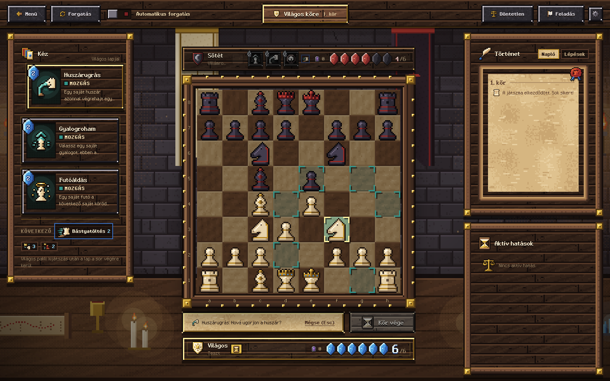
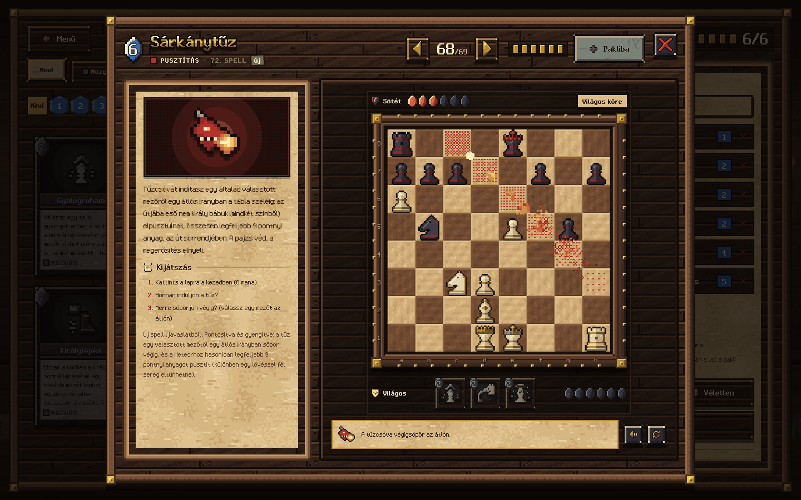

# Mana Chess

Böngészőben futó sakk Clash Royale-szerű mana- és spell-rendszerrel: 71 varázslat, 6 lapos pakli, 3 lapos kéz és
kártyaciklus. Helyi 1v1 (egy gépen), egyszerű AI ellenfél, és online játék saját szerveren – fiókokkal, a szerveren
tárolt paklikkal, barátlistával és kihívásokkal, vagy fiók nélkül a helyi hálózaton (lásd [Online játék](#online-játék)).



## Indítás

```bash
npm install
npm run dev            # fejlesztői szerver (http://localhost:5173)
npm test               # unit tesztek (Vitest)
npm run build          # dist/mana-chess.html (egyetlen, önálló fájl) + dist/frontend.mjs (a játékoldal-szerver)
npm run typecheck      # típusellenőrzés
npm run docs:spells    # SPELLS.md újragenerálása a spell-regiszterből
npm run balance        # egyensúly-teszt: AI kontra AI véletlen paklikkal → BALANCE.md (~20 perc, 2 szálon)
npm start              # a játékoldal-szerver (http://localhost:4545, a dist/mana-chess.html-t adja)
```

Telepítés nélkül is kipróbálható: a GitHub Releases oldalon lévő `mana-chess.html` fájlt nyisd meg a böngészőben
(előre buildelt, önálló verzió). A backend külön repóban van: **mana-chess-backend**.

**Telefonon** is játszható. Álló helyzetben minden egy képernyőn van, görgetés nélkül: az ellenfél, a tábla (akkora, amekkora
kifér), az állapotsor, a kezed három kis lapja a „Kör vége” gombbal, és alul te. A Történet és az Aktív hatások a felső sáv
tekercs-gombjával csúsznak fel; a lapok sarkában lévő gomb (és az ellenfél kis lapjai) megnyitják a teljes leírást a bemutatóval.
Fekvő helyzetben a tábla balra kerül, minden más mellé. A menü, a csata-előkészítés, az Online képernyő (két füllel: Játék és
Barátok) és a pakliépítő (három
lap soronként, a pakli lapjai a fejlécben) szintén telefonra szabott; dupla koppintásra nem nagyít, és a lehúzás sem tölti
újra az oldalt. A böngésző „Hozzáadás a kezdőképernyőhöz” menüpontjával teljes képernyős alkalmazásként indul.

Technológia: React 19, TypeScript (strict), Vite, Vitest, sima CSS. A teljes megjelenés saját készítésű pixel-art
(betűtípusok, sprite-ok, textúrák, jelenetek, effektek, hangok) – külső kép- vagy hangfájl nélkül, lásd lent.

## Játékszabályok röviden

- **Sakk:** teljes szabályrendszer – sakk, matt, patt, sáncolás, en passant, gyalogátváltozás (választható bábu).
- **Mana:** kezdéskor 3, maximum 6. Minden saját kör elején +1 (az első saját kör a kezdő 3 manával indul),
  bábuval végrehajtott ütésért +1. A 6 feletti mana elveszik (a UI jelzi). A spell ára azonnal levonódik.
- **Pakli és ciklus:** 6 különböző spell; a kéz az első 3. A kijátszott lap a pakli végére kerül, a következő belép:
  `A B C → B C D → C D E → D E F`. A UI a kéz mellett a ciklus sorrendjét is mutatja.
- **Költségkorlát (kérésre):** egy pakliban legfeljebb **egy 6 manás** (Meteor, Valóságtörés, Sárkánytűz, Végzet) és
  **egy 5 manás** spell lehet (a lap alapára számít, így a Klón 2 manásnak). A pakliépítő nem engedi a másodikat
  betenni (a könyvtárban halványan látszik, kattintásra megmondja, melyik lap foglalja a helyet), a mana-görbe 5-ös és 6-os
  oszlopán szaggatott vonal jelzi a határt. A korábban mentett, szabálytalan saját paklik nem vesznek el: a listában
  „javítandó” jelzést kapnak, és amíg ki nem javítod őket, nem választhatók csatára. Az Időmester előre elkészített
  pakliban az Időmegállítás helyére a Vihar került (két 5 manás lapja volt).
- **Kör:** normál lépés és/vagy tetszőleges számú spell (amíg van mana). A spellek nem fejezik be a kört; a normál lépés
  automatikusan igen. Lépés nélküli kör (csak spell) a „Kör vége” gombbal zárható – sakkban soha.
- **Véletlen pakli:** a menüben „🎲 Véletlen pakli” választható bármelyik oldalnak – minden játszma (és visszavágó)
  elején új, 6 különböző lapból álló paklit kap: legfeljebb egy 6 és egy 5 manás, legalább 2 db 1–2 manás spell, és a
  kezdő kézben mindig van 3 manából kijátszható lap. A pakliépítőben a „🎲 Véletlen” gomb ugyanígy tölti fel a szerkesztőt.
- **Spell-toborzás (játékmód):** saját paklik helyett – a *Csatába!* → *Paklik* résznél, online szobában és kihívásban
  is választható. 32 véletlen, különböző spell kerül egy 8 × 4-es asztalra (telefonon 4 × 8); felváltva választotok
  egyet-egyet – Világos kezd –, amíg mindkettőtöknek 6 lesz. A választások sorrendje a pakli sorrendje, az első három
  a kezdő kéz. A költségkorlát itt is él (a második 6 vagy 5 manás lap lakattal jelölve), és az asztalon mindig van
  legalább 8 db 1–2 manás lap. Az AI a spellek egyensúly-teszt szerinti értékéből választ; online a szerver osztja az
  asztalt és ellenőriz minden választást, a visszavágó új toborzással indul.
- **Győzelem:** matt. Döntetlen: patt, 50 lépés ütés/gyaloglépés nélkül, csupasz királyok, megegyezés. Feladás is van.
- **Vissza / Előre (helyi 1v1):** félrekattintás esetére a felső sávban (keskeny képernyőn a tábla alatt) két nyíl van,
  billentyűvel Ctrl+Z / Ctrl+Y (Ctrl+Shift+Z, Macen ⌘). A Vissza egyenként visszavon minden lépést – normál lépést,
  spellt a manájával együtt, átváltozást, kör végét, sőt a matt, feladás vagy döntetlen utáni állást is –, az Előre
  ugyanazt játssza le újra. Új lépés után a visszavont ág elvész. Az AI elleni játékban nincs visszavonás.

## Szabály-értelmezések (ahol a specifikáció nyitva hagyott valamit)

| Kérdés | Döntés |
| --- | --- |
| Első kör manája | Mindkét játékos a kezdő 3 manával játssza az első körét; a +1 a második saját körtől jár (`MANA.GRANT_ON_FIRST_TURN`). |
| Spell „a lépés előtt vagy után” vs. „a lépés után automatikusan az ellenfél jön” | Alapértelmezés: automatikus körvég, spellek a lépés előtt (és a Dupla lépés bónuszfázisában). A menüben választható **Kézi** mód: a lépés után is lehet varázsolni, a kört gomb zárja. |
| Spell és a saját király | Spell nem hozhatja sakkba a saját királyodat. Ha már sakkban vagy, varázsolhatsz, de a kört csak a sakk elhárítása után zárhatod. |
| Matt spellekkel | Matt = sakkban vagy, nincs szabályos lépésed, és a kezedben lévő egyetlen spell sem vezet olyan állásba, ahonnan lépni tudsz vagy befejezheted a kört. Ha van ilyen spell, a játék folytatódik („csak egy spell menthet meg”). Patt ugyanez sakk nélkül. |
| Spellel végzett lépések | A Huszárugrás / Bástyatöltés normál ütési szabályokkal üthet, és ez is +1 manát ad. A spellel való pusztítás (Kivégzés, Meteor) nem ad manát. |
| Védelmek vs. spellek | A pajzsok (Gyalog-/Huszárpajzs) a lépéses és a spelles ütés ellen is védenek; a Megerősítés elnyeli az első kísérletet (a támadó visszapattan). A Halálbélyeg mindkettőt felülírja. |
| Debuffok | Királyra nem tehetők. A mozgásukban korlátozott bábut a saját spelljeid sem mozgathatják. |
| Lejáró hatások | Ha egy hatás (pl. fal) a kör végén megszűnik, a motor azt is ellenőrzi, hogy a lejárat után se maradjon a lépő király sakkban – így nem keletkezhet szabálytalan állás. |
| Véletlen | Szerencsén alapuló mana-spell nincs. A Káosz cseréje determinisztikus: a játékállapotban tárolt seedből dolgozik (online szinkronhoz). |

### Változások kérésre

- **Meteor:** egy becsapódás összesen legfeljebb **9 pontnyi** anyagot pusztíthatott el (gyalog/rabszolga 1, huszár/futó 3,
  bástya 5, vezér 9) – az egyensúly-teszt után ez **4 pont**, és bástyára, vezérre nem lehet lőni (lent). A célpont után először az
  ellenséges, majd a saját szomszédos gyalogokat/rabszolgákat éri.
- **Kivégzés:** 6 → **5 mana**. **Megerősítés:** 2 → **4 mana**. **Teleport:** 4 → **5 mana**.
- **Kivett spellek:** Tűzés, Manalopás, Dupla vagy semmi és Ködfátyol (egy gépen játszva a rejtés semmit sem ért).
  A mentett paklikban automatikusan lecserélődnek (Gyengítés, Manaelszívás, Arcane Surge, Láthatatlanság – ha az már
  benne van, az első hiányzó spell).
- **Új spell – Brigád (3 mana; bevezetéskor 5):** 5 **rabszolgát** idézel a saját 1–3. sorodba, a választott üres mezőkre. A rabszolga
  gyalogszerű bábu: csak egy mezőt léphet előre (kettőslépés sincs), nem üthet – ezért nem támad és sakkot sem ad –,
  és nem változik át. Leütni lehet (1 pont; mana nem jár érte – az egyensúly-teszt óta), és blokkolhat: sakk elől is
  lehet vele menekülni.
- **Új spell – Klón (3–5 mana):** egy saját (nem király, nem vezér) bábud másolatát lerakod a bábu melletti szabad
  mezőre, ha onnan nem ad sakkot. Ára a bábu értékének fele + 2, felfelé kerekítve (gyalog/rabszolga 3, huszár/futó 4,
  bástya 5; bevezetéskor +1 volt, és a vezér is klónozható volt). A klón félig átlátszó, ugyanúgy mozog, mint az
  eredeti, és amint leüt valamit, szertefoszlik (az ütés +1 manáját megkapod). Egyszerre csak egy klónod lehet. Kártyán
  „3–5” áron látszik; célzáskor a pontos ár a státuszsorban.
- **Új spell – Francia sajt (3 mana; bevezetéskor 2; Taktika):** egy saját gyalogod ebben a körben (a normál lépéseként) en passant
  üthet **bármilyen** közvetlenül mellette álló ellenséges bábut: átlósan előre lép az üres mezőre, a mellette álló
  bábu megsemmisül. Királyt és vezért nem üthet; a pajzs véd, a megerősítés elnyeli. A 7. soron átváltozással is működik.
- **Új spell – Futólövész (4 mana, Pusztítás):** egy saját futód ebben a körben (a normál lépéseként) lelőhet egy
  bábut, amelyet szabályosan leüthetne – a futó a helyén marad (lövés-animáció: torkolattűz, nyomjelző, becsapódás).
  Mivel nem mozdul, akár kötött futó is lőhet a kötés vonalán kívülre. A lövés ütésnek számít (+1 mana).
- **Új spell – Mana mágus (2 mana; bevezetéskor 3; Mana):** egy legfeljebb 3 pontos saját bábu (gyalog, rabszolga, huszár, futó)
  a következő 3 saját körödben +1 extra manát ad a kör elején (összesen +2/kör), és ha üt vele, +1 extra manát kapsz
  a szokásos +1 mellé. Aki **spellel** öli meg, az azonnal −1 manát veszít (a spell ára után); normál ütésnél nincs
  büntetés. Egyszerre csak egy mana mágusod dolgozik: az új a régi helyére lép (az egyensúly-teszt óta).
- **Némaság:** 1 → **2 mana**.
- **Új spell – Akna (4 mana, Terep):** aknát rejtesz egy mezőre (üresre vagy bábu alá, királyé kivétel). Az ellenfél
  következő körének végén felrobban, és elpusztítja a rajta álló nem király bábut (bármelyik színűt). A pajzs /
  megerősítés megvédi a bábut, de a robbanásban megsemmisül. A mellette álló király a lépéseként hatástalaníthatja
  (✂️ – helyben marad), és ha rálép, az is hatástalanítja. Az akna mindkét fél számára látható; a robbanást a
  sakkszabályok is figyelembe veszik (ha a robbanás a királyodat sakkba hozná, azt el kell hárítanod).
- **Új spell – El az útból! (2 mana, Mozgás):** egy saját (nem király) bábu félreáll egy szomszédos üres mezőre (nem
  normál lépés). A kör végéig senki sem léphet az eredeti mezőjére (áthaladni szabad), a félreállt bábu nem léphet
  tovább, és a kör végén automatikusan visszatér. Aknát is ki lehet vele cselezni: a robbanás előtt félreáll, utána
  visszajön.
- **A 50 javaslatból 16 került be** (Gyorssánc, Gyalogugrás, Provokáció, Láthatatlanság, Mágnes, Taszítás, Mana-letét,
  Cserkész, Mana-szomj, Átképzés, Vihar, Pajzsromboló, Gravitációs kút, Mana-armageddon, Sárkánytűz, Végítélet),
  több közülük módosított áron vagy pontosítva (pl. a Sárkánytűz a Meteorhoz hasonlóan korlátozott anyagot éget el –
  ma legfeljebb 4 pontnyit). A többi 34 kimaradt, főleg mert egy meglévő spell már ugyanazt tudja – a lista indoklással a
  [SPELLS.md](SPELLS.md)-ben és a játék Szabályok oldalán.
- **Végítélet (6 → 5 mana, az egyensúly-teszt után 4):** már csak a te térfeleden (a saját szemszögedből az 1–4. sorban) álló ellenséges
  gyalogokat és rabszolgákat pusztítja el; a saját gyalogjaidat nem bántja. Kijátszáskor a Kaszás – egy sakkbábunak
  faragott, csuklyás kaszás – kiemelkedik a padlóból, a királyodhoz legközelebbi áldozattal kezdve egyenként
  kettévágja őket (a pajzs itt is véd), majd füstté válik; harangszó és kaszasuhintás kíséri.
- **Nekromancia:** 5 → **2 mana**. **Gyengítés:** 2 → **3 mana**. **Hatástalanítás:** 3 → **2 mana**.
- **Új spell – Üvegátok (2 mana, vezérre 3; Irányítás):** egy ellenséges (nem király) bábut üveggé átkozol az ellenfél
  következő körének végéig: ha ezalatt leüt valamit – lépéssel vagy spell segítségével –, az ütés után maga is darabokra
  törik (a leütés megtörténik, és a manát is megkapja érte). Pajzs vagy megerősítés nem menti meg, mert ez nem ütés. Ha az
  összetörés után felszabaduló mező a saját királyát sakkba hozná, az ütés szabálytalan. Klónra és rabszolgára nem tehető
  (azok úgysem üthetnek tovább). Az átkozott bábu üvegesen csillan; ha üt, megreped és szilánkokra hullik.
- **Új spell – Végzet (6 mana, Pusztítás) – körforgással:** egy ellenséges gyalog vagy rabszolga elpusztul – minden más
  bábut csak a felébredt Végzet sújthat (az egyensúly-teszt óta); semmi sem védi
  (pajzs, megerősítés, Utolsó esély, Láthatatlanság). A lökéshullám a 8 szomszédos mezőn minden nem király bábut egy
  mezővel egyenesen kifelé lök, ha ott üres a mező; ha ez a saját királyodat sakkba hozná, az a célpont nem választható. Az
  ellenfél minden kijátszáskor **+1 manát kap** (tele kristályoknál elvész).
  - **Körforgás (mint a Clash Royale evolúciói):** a sima kijátszás „csak” elpusztítja a bábut – a leütöttek közé kerül,
    tehát a Nekromancia vagy a Visszatekerés még visszahozhatja, és rövid, súlyos becsapódás kíséri. Minden sima
    kijátszás egy töltésjelet gyújt a lapon; kettő után (az egyensúly-teszt óta; korábban egy után), amikor a lap három
    másik után visszajön a kezedbe, **felébredt** – lila kerettel, izzó töltésjelekkel. A sorban várakozó feltöltött lap is
    lilán világít.
  - **Felébredt Végzet:** a bábu kitörlődik a létezésből – nem kerül a leütöttek közé, semmi sem hozza vissza. Ha tiszt
    volt (vezér, bástya, futó, huszár), az ellenfél ezt a bábufajtát végleg elveszíti: gyalogja nem változhat ilyenné (az
    átváltozás-választóban a kitörölt bábu üres, lila szélű lyukként, áthúzva látszik), és Klónnal vagy Átképzéssel sem
    hozhat létre újat; ha mind a négy tisztfajtát elveszítette, gyalogja nem léphet az utolsó sorra. Ekkor jön a mozi: a
    zene elhallgat, a tábla elsötétül, a valóság megreped, minden megmentési kísérlet szétreped, a kamera ráközelít, a bábu
    egy pontba szippantódik és összeomlik, a szomszédok szétrepülnek, a VÉGZET felirat szétporlik, és egy mély
    basszusütéssel visszatér a zene; végül egy manaszikra kúszik ki az ürességből az ellenfél kristályaihoz. Amíg tart, a
    táblán nem lehet lépni (az AI is kivárja). A felébredt kijátszás után a lap újra töltődni kezd.
  - A bemutató mindkettőt megmutatja: a (már egyszer körbejárt) lap sima kijátszását, a pakli körbefordulását, majd a
    felébredt lapot.
- **Új előre összeállított paklik:** Utászok (akna, mágnes, taszítás, provokáció) és Sárkányszív (pajzsromboló,
  vihar, sárkánytűz).

### Egyensúly-módosítások (az egyensúly-teszt alapján)

Az első [egyensúly-teszt](BALANCE.md) (1000 AI-játszma véletlen paklikkal) szerint a 6 manás lapok eldöntötték a
játszmát: a pakli, amelyben volt, 78–85%-ot ért el. Több kör módosítás után – mindegyik után újra lefuttatva, ugyanazokkal
a paklipárokkal – a lapok közti szórás 10.1-ről 6.6 százalékpontra csökkent (a véletlen önmagában kb. 4-et adna), a
99%-on kiugró lapok száma 14-ről 4-re, a 6 manás lapok átlaga +30-ról +10-re.

| Spell | Változás | Δ előtte → most |
| --- | --- | ---: |
| ☄️ Meteor | legfeljebb 4 pont (9 helyett): bástyára, vezérre nem lő | +35 → +11 |
| 🐉 Sárkánytűz | legfeljebb 4 pont (9 helyett): bástyát, vezért a tűz átugorja | +30 → +14 |
| 🔮 Valóságtörés | csak a saját bábukon siklanak át; a „+1 mező bármely irányba” kimaradt | +28 → +9 |
| 🌑 Végzet | a sima kijátszás csak gyalogot, rabszolgát sújt; két sima kijátszás után ébred fel; felébredve bármit kitöröl | +28 → +6 |
| 🧬 Klón | minden klón +1 mana (3–5), vezért nem lehet, egyszerre egy klón | +16 → +10 |
| 🧀 Francia sajt | 2 → 3 mana, vezért nem üthet | +15 → +9 |
| 🧙 Mana mágus | 3 → 2 mana, egyszerre egy mágus dolgozik (az új a régi helyére lép) | +13 → +1 |
| 📣 Provokáció | 2 → 3 mana | +8 → +11 |
| 🧱 Fal | 2 → 1 mana | −10 → −2 |
| 🧲 Gravitáció | 3 → 2 mana | −12 → −4 |
| 🌋 Földrengés | 4 → 3 mana | −8 → −1 |
| 🕊️ Utolsó esély | 5 → 3 mana | −12 → −3 |
| 🏯 Újrasáncolás | 3 → 1 mana | −11 → −4 |
| 👣 Királylépés | 2 → 1 mana | −11 → −7 |
| ☠️ Végítélet | 5 → 4 mana | −9 → −5 |
| 🕯️ Áldozat | +1 helyett +3 mana | −8 → −8 |
| 👥 Brigád | 5 → 3 mana; a rabszolga leütéséért nem jár mana | −22 → −29 |

Δ: a lapot tartó pakli pontszáma mínusz a szín átlaga, százalékpontban; egy futásban kb. ±8 a bizonytalanság. Amit a
teszt nem tud megítélni: a Brigád rossz száma az AI-é – a rabszolgákat szinte találomra rakja le, és a saját bábuit
torlaszolja el velük (az értékelése nem ismeri a mozgékonyságot); a Dupla lépést, a Megerősítést, a Mana-szomjat és az
Utolsó esélyt az AI szinte sosem játssza ki, az Áldozatot pedig ritkán, így ezekről ember kell döntsön. Az AI közben
megtanulta kijátszani az Azonnali átváltozást (eddig nem számolta bele az átváltozást), és ha a királyát csak egy távoli
célpontú spell mentheti, már nem akad el.

A módosított, új és kivett spellek teljes listája indoklással: **[SPELLS.md](SPELLS.md)** (és a játékban: Menü → Szabályok és spellek).

## Architektúra

```
src/
  engine/                 tiszta TypeScript, nincs React-függőség
    types.ts              GameState, Action, Effect … (mind JSON-szerializálható)
    board.ts, rng.ts      koordináták, FEN, determinisztikus RNG
    effects.ts            buffok/debuffok, lejárat, gyors keresőtáblák
    movegen.ts            hatásérzékeny lépésgenerálás, támadás, sakk, biztonság
    game.ts               createGame + applyAction (reducer), körmenet, matt/patt/döntetlen
    mana.ts, rules.ts     mana (max, plafon), körvég-szabályok
    pieceOps.ts           spell-műveletek: áthelyezés, csere, pusztítás, spell-lépés
    spells/
      types.ts            Spell interfész
      definitions.ts      mind a 71 spell
      cast.ts             közös varázslási keretrendszer (mana, ciklus, célpont-validálás szimulációval)
    decks.ts              előre elkészített paklik, validálás
    draft.ts              Spell-toborzás: az asztal (32 lap), a választások sorrendje és ellenőrzése
  ai/simpleAI.ts          2 rétegű alfa-béta kereső + spell-értékelés
  ai/draftAI.ts           az AI választása toborzáskor
  net/protocol.ts         online: üzenetek, setup → játék, visszajátszás, állás-ujjlenyomat (hash)
  net/client.ts           online: szobák, fiókhívások, egy szék és egy fiók élő kapcsolata (long polling, újrakapcsolódás)
  ui/
    App.tsx, GameScreen.tsx   képernyők és képernyőváltások (könyvlapozás, jelenetváltás, elsötétülés)
    useGame.ts            játékállapot + AI; minden sikeres akcióból egy „batch” (előtte/utána állapot)
    netSync.ts            online játszma szinkronban a szerverrel (azonnali saját lépés, ütemezett ellenfél-lépések)
    online/useOnline.ts   a backend címe, a bejelentkezett fiók (profil, barátok, kihívások) és a fiók élő adatfolyama
    components/           Menu, DeckBuilder, Draft (a toborzás asztala), SpellInspector + SpellDemo, Rules, Board, …
      online/             az Online képernyő: szerver → belépés/regisztráció/vendég → lobbi (játék + barátok)
    demo/scenarios.ts     bemutató-forgatókönyvek mind a 71 spellhez (az engine-nel lefuttatva)
    pixel/                paletta, sprite-motor, bábuk, 71 spell-ikon, UI-ikonok, állapotjelek, betűtípus-adatok
    scenes/               procedurális pixel-jelenetek és textúrák (táj, haditanács-terem, tábla, keretek)
    vfx/                  effekt-motor (pixel-puffer), primitívek, spell-effektek, koreográfia
    audio/sound.ts        Web Audio szintetizált hangok és környezeti zajok
    styles/               design rendszer: tokenek, komponensek, menü, pakliépítő, játék, effektek
server/frontend.ts        a játékoldal-szerver: csak a játékot adja, szigorú CSP-vel
                          (a backend külön repóban van: mana-chess-backend)
scripts/                  egyfájlos build (build-single.mjs), játékoldal-szerver build, verzió-hash, SPELLS.md
                          generátor, egyensúly-teszt (balance.ts), betűtípus- és ikonrajzolók
tests/                    Vitest: sakk (perft), mana/ciklus, spellek, fuzz, animáció-koreográfia, online szinkron
                          (fixtures/lobby.ts: a backend szobáinak másolata), játékoldal-szerver
docker/, release/         a Docker-kép állapotellenőrzője; Start.bat / start.sh / README.txt Docker nélkül
```

**A lényeg:** a játékállapotot kizárólag `applyAction(state, action)` változtatja, tisztán (a régi állapot érintetlen).
Az ember, az AI és az online ellenfél ugyanazokat az akciókat küldi (`MOVE`, `CAST`, `PROMOTE`, `END_TURN`,
`RESIGN`, `AGREE_DRAW`), így nincs „kiskapu” a szabályok körül, és egy akciólista mindig ugyanarra az állásra vezet.

## Megjelenés: pixel-art pipeline

A felület egy középkori, fáklyafényes haditanács-terem: fa, vas, pergamen, sárgaréz; a mana kék, a tűz parázsszínű,
a lila csak varázslat-akcentus. Minden grafika a `src/ui/pixel/palette.ts` mesterpalettájából készül.

- **Betűtípusok** – két saját pixelfont (`Mana Pixel`, `Mana Gothic`), kézzel rajzolt bitmapekből TrueType-ba
  (`scripts/fonts/*.py`, fontTools), WOFF data URI-ként beágyazva.
- **Sprite-ok** – szöveges sorokból (palettakulcsok) rajzolt sprite-ok automatikus körvonallal és fényárnyékolással
  (`pixel/sprite.ts`), PNG data URL-be gyorsítótárazva, `image-rendering: pixelated`-del megjelenítve. A 71 spell
  ikonja a `scripts/icons/group_{a,b,c}.py` szkriptekből generálódik (`python3 scripts/icons/group_a.py`).
- **Jelenetek és textúrák** – a menü parallax tája (felhők, zászlók, madarak, fáklya) és a játék mögötti terem
  (fáklyák, gyertyák, por) procedurálisan, kis vásznakon készül; a keretek 9-szeletes `border-image`-ek.
- **Effektek** – `vfx/engine.ts`: egy teljes képernyős vászon a tábla pixelrácsán; részecskék, gyűrűk, fényoszlopok,
  villámok, lövedékek, bélyegek, szétrobbanó bábu-sprite-ok, rendezett ditheres áttűnések. Csak akkor fut, ha van mit
  rajzolni.
- **Koreográfia** – `vfx/choreo.ts` az engine eseményeiből és a két állapot különbségéből időzített tervet készít:
  melyik bábu csúszik, ugrik, teleportál vagy tűnik fel, mikor törik szét a leütött bábu, mikor reped és nő vissza a
  mana-kristály, mikor jön a „A VILÁGOS KÖRE” szalag, a SAKK! bélyeg és az eredményképernyő. A 71 spell mindegyike saját
  effektet kap (`vfx/spells.ts`).
- **Hang** – `audio/sound.ts` Web Audio szintézis (UI, sakk, varázslat, mana, környezet), master/effekt/környezet
  hangerővel; az első kattintás után indul. Minden hang egy recept, mintára cserélhető.
- **Spell-bemutató** – a Pakliépítőben egy lapra kattintva (vagy a Szabálykönyv spell-listájában egy sorra) megnyílik a
  teljes lap: leírás, a kijátszás lépései, időzítési szabályok, és mellette egy kis haditábla, ahol egy mutató kesztyű
  végigjátssza a spellt – kiválasztja a lapot, rámutat a célpontokra (átváltozásnál a bábut is kiválasztja), lefut a valódi koreográfia és effekt, és ahol kell,
  egy utólépés megmutatja, mit tett lehetővé (pl. Gyalogroham után a két mezős lépés). A forgatókönyveket
  (`ui/demo/scenarios.ts`) az engine futtatja le, így a bemutató sosem mutathat szabálytalan dolgot. A lap sarkában lévő
  **+** pecsét azonnal a paklihoz adja (vagy kiveszi) a lapot; a nyilakkal / ← → billentyűkkel lapozhatsz, Esc bezár.
  Játék közben a kézben lévő lap egy rövid rámutatás után kinyílik (a szomszédai fölé), így a teljes leírás olvasható.

  
- **Mozgás** – a Beállításokban kikapcsolható teljes animáció (és követi az operációs rendszer
  „csökkentett mozgás” beállítását): ilyenkor nincs háttéranimáció és rázkódás, az effektek rövidebbek.

### Új spell hozzáadása

1. Vedd fel az azonosítót a `SpellId` típusba (`src/engine/types.ts`).
2. Írd meg a spellt a `definitions.ts`-ben és tedd a `SPELL_LIST`-be:

```ts
const frostNova: Spell = {
  id: 'frostNova', number: 51, name: 'Fagyhullám', manaCost: 3, category: 'Irányítás', icon: '🧊',
  description: 'A kiválasztott mezővel szomszédos ellenséges gyalogok a következő körükben nem mozoghatnak.',
  targetType: 'emptySquare', steps: [{ prompt: 'Válassz egy mezőt.' }],
  getTargets: (c) => emptySquares(c.state),
  execute: (c, [s]) => {
    for (const n of neighbours(s)) {
      const p = c.state.board[n];
      if (p?.type === 'P' && p.color === c.opp) pieceBuff(c, n, 'frozen', T(c) + 1, 'frostNova');
    }
  },
};
```

Ha az ár a célponttól függ (mint a Klónnál), add meg a `costFor` függvényt és egy `costLabel`-t; a keretrendszer
a konkrét célponthoz tartozó árat vonja le, és csak a megfizethető célpontokat engedi. Ha a spell több, egymástól független célpontot kér (mint a Brigád 5 mezője), állítsd be a `fastTargets: true`
jelzőt – így a keretrendszer nem próbálja végig az összes kombinációt. A keretrendszer minden mást elintéz: mana és Túltöltés-kedvezmény, Némaság/Időmegállítás, ciklus, a célpontok
szűrése szimulációval (csak szabályos kimenetelű célpont választható), naplózás és animációs események. Ha a spell új
tartós hatást igényel, vedd fel az `EffectKind`-ba, és kezeld a `movegen.ts`-ben.

A megjelenéshez: rajzolj egy 14×14-es ikont a `scripts/icons/` valamelyik csoportjába (vagy közvetlenül a
`src/ui/pixel/art/spells_*.ts`-be), és adj egy effektet a `src/ui/vfx/spells.ts` `SPELL_FX` táblájába (a TypeScript
jelzi, ha hiányzik). Az effekt megmondja, hogyan mozogjanak az érintett bábuk (`blink`, `slide`, `leap` …), hogyan
tűnjenek el (`burn`, `shatter`, `dissolve` …), és rajzolja a varázslatot a primitívekből.

## Online játék

Két külön program, két külön repóban (Node.js, függőségek nélkül; Docker-képként is – a szerverre telepítést a
backend repó DEPLOY.md-je írja le lépésről lépésre):

- **Backend** (`mana-chess-backend/`, alapból az 5454-es porton): fiókok, a fiókok paklijai, barátok és jelölések,
  kihívások, játékszobák. Sima HTTP; interneten az Nginx Proxy Manager (NPM) adja elé a HTTPS-t, így a 443-as
  porton bárhonnan elérhető. Ugyanez a program egy külön porton (**5555**) adja a webes **vezérlőpultot** – az csak
  a szerver gépéről érhető el (`127.0.0.1`), máshonnan SSH-alagúttal vagy Tailscale-lel; a nyilvános porton nincs
  semmilyen admin-funkció.
- **Játékoldal / frontend** (`mana-chess-frontend/`, 4545-ös port): csak a játékot (`mana-chess.html`) adja a
  böngészőknek. `--backend` (vagy a `MANA_BACKEND` környezeti változó) alapértelmezett backendet ír a lapba;
  ha nincs megadva és a lap http-n jött, a játék ugyanazon a gépen az 5454-es portot próbálja.

Szerverre Dockerrel: egy `docker-compose.yml` és `docker compose up -d` (lásd a backend-repó `DEPLOY.md`-jét).

**A játékban** (főmenü → *Online*): 1. a backend címe (`ip:port` a helyi hálózaton, `https://…` interneten);
2. *Belépés*, *Regisztráció*, vagy *Vendégként* (LAN mód, fiók nélkül); 3. a lobbi:

- *Új játszma*: saját pakli (bejelentkezve a fiók paklijai, vendégként a böngészőéi) vagy *Spell-toborzás*, szín,
  körvég-mód, *Szoba nyitása*. A listában a toborzásos szobák „toborzás” jelzést kapnak.
- *Játszmák*: beérkezett kihívások (elfogadás / elutasítás, 5 percig érvényes), folytatható játszmák (fiókkal bármelyik
  eszközről), nyitott szobák (a vendégeké „vendég” jelzéssel), belépés négybetűs kóddal.
- *Barátok*: keresés név szerint, jelölés, elfogadás / elutasítás / visszavonás, a barátok jelenléte (online, játszik,
  nincs bent) és *Kihívás* (saját paklival vagy toborzással) – ha a barát elfogadja, mindkettőjüknek azonnal indul a
  játszma. Fiók: jelszócsere, kijelentkezés; adminnak emlékeztető, hol a vezérlőpult. A bejelentkezés (kérésre)
  megmarad az eszközön.
- A pakliépítő bejelentkezve a fiókba ment; a böngészőben lévő paklik egy gombbal feltölthetők.

**Vezérlőpult** (külön port, alapból 5555, csak a szerver gépéről; csak adminisztrátori fiókkal lehet belépni):
első indításkor a szerver ablakában kiírt *beállítókóddal* jön
létre az első admin (elfelejtett jelszóhoz: `--setup`). Regisztráció: zárva / jóváhagyással / nyitott (automatikus
elfogadás); kézi fióklétrehozás (azonnal használható), jóváhagyás, törlés (a barátkapcsolatokkal, kihívásokkal és
szobákkal együtt), új jelszó, admin jog, kijelentkeztetés, vendégjáték be/ki, zárolt fiókok és kitiltott címek,
napló. Beépített **fail2ban**: ugyanarra a fiókra 5 hibás jelszó → a fiók 10 percre zárolva (a helyes jelszóval sem
lehet belépni); egy címről 10 hiba → a cím 10 percre kitiltva a belépésből és a regisztrációból (mindkettő állítható
és feloldható). Proxy mögött az `X-Real-IP` / `X-Forwarded-For` fejlécnek csak helyi (NPM) forrásból hisz.

**Biztonság:** jelszó sózott scrypt-tel, munkamenet-token 32 bájt véletlen (csak a hash-e tárolva, 30 nap
tétlenség után lejár), időzítés-független összehasonlítás, ismeretlen névre is ugyanannyi munka, kérés- és
regisztráció-korlát címenként, a vezérlőpult külön, csak helyben figyelő porton, szigorú CSP-vel, CORS nélkül és
keretezés-tiltással. Az adatok egy JSON-fájlban
(`data/mana-chess.json`), atomikus írással. A böngésző https-oldalról nem érhet el http-s szervert – interneten
ezért a backend is az NPM-en át, https-sel érhető el; a claude.ai-os artifactból is csak https-es backend érhető el.

**Hogyan működik a játszma:** a motor determinisztikus – a setup (paklik, seed, beállítások) és az akciólista mindig
ugyanarra a játszmára vezet –, így a szervernek és a böngészőknek csak ezeken kell megegyezniük.

- A szerver (`server/lobby.ts`) hiteles: maga is futtatja az `applyAction`-t, csak a soron lévő játékostól fogad el
  akciót, sorszámozza az elfogadottakat, és mindegyik mellé az új állás hash-ét küldi. Minden bemenetet megtisztít
  (név, pakli-validálás, akciómezők), a feladást mindig a küldő színére írja át.
- Szállítás: sima HTTP + JSON long pollinggal (25 mp) – a szobáké és a fiók saját adatfolyamáé (jelölések,
  kihívások, barátok jelenléte). Nincs szükség könyvtárra, átjut routereken és proxykon (NPM), és egy fájlból
  megnyitott oldal is használhatja (CORS, `text/plain` kérések, előzetes kérés nélkül; a token a kérés törzsében).
- A böngésző (`src/ui/netSync.ts`) a saját lépést azonnal megmutatja, és sorban elküldi; a szerver adatfolyama
  a nonce alapján visszaigazolja. Ha közben más történt a szerveren (pl. az ellenfél feladta), a saját lépést
  visszatekeri. Az ellenfél lépései egyenként jelennek meg, kivárva az animációkat (a filmszerű spellekét is).
  Hiányzó esemény vagy eltérő hash esetén az egész játszmát letölti és újrajátssza – a szerver mindig nyer.
- A szerver és a játékfájl verzióazonosítója (`BUILD_ID`, a motor forrásaiból számolt ujjlenyomat) egyezik;
  eltérő szabályokkal épült oldalt a szerver nem enged be.
- A szobák a szerver memóriájában élnek (újraindításkor elvesznek; a fiókok és paklik megmaradnak). A seed mindkét
  kliens számára ismert, ez baráti játékhoz rendben van; versenyszerű játékhoz a véletlent szerveroldalon kellene feloldani.

## Tesztek

- **Perft** az ismert referenciaállásokra (kezdőállás 3 mélységig = 8902, Kiwipete, 3–5. pozíció) – ez igazolja a
  sáncolást, en passant-t, átváltozást és a kötéseket.
- Matt, patt, döntetlenek, sakk-kényszer, átváltozás (függő választással is).
- Mana: kezdés, körönkénti +1, 6-os plafon és elvesző többlet, ütés-mana (lépéssel és spell-lépéssel).
- Ciklus: pontosan a specifikáció A→F példája; középső lap kijátszása; Gambit.
- Minden spell viselkedése külön tesztben, köztük: király sakkba kerülése spell után, spell + normál lépés,
  védelmek, Visszatekerés, Dupla lépés, spelles átváltozás, sáncolás (Újrasáncolás, fal), spellel kiváltott matt és
  spellel elkerült matt.
- **Fuzz:** 60 véletlen játszma véletlen paklikkal (~9500 akció, ~2500 spell, a játszmák negyede „Kézi” körvég módban) – minden akció után invariánsok:
  pontosan egy király színenként, a kört befejező játékos nincs sakkban, mana 0 és a plafon között, a pakli a 6 lap
  permutációja, nincs gyalog az 1./8. soron, nincs bábu falon, a bábuszám állandó. Plusz egy 40 játszmás fuzz csak
  a legújabb spellekkel (aknák, El az útból!, Provokáció, Mágnes…), és AI kontra AI.
- **Koreográfia:** minden kijátszható spellből animációs terv készül, és az effekt-motor fej nélkül (headless) végigjátssza –
  semmi sem dob hibát, és minden effekt magától lejár.
- **Bemutatók:** mind a 71 spellnek van bemutatója, a lap a kezdő kézben van, és minden lépése (kijátszás, utólépések)
  szabályos akcióként újrajátszható.
- **Online:** a szerver szobái (hitelesség, elavult és szabálytalan akciók, döntetlen, visszavágó, kilépés, jelenlét),
  valódi HTTP-n két klienssel, valamint a böngészőoldali szinkron versenyhelyzetekkel: a saját lépéssel keresztbe futó
  feladás, elveszett válasz és ismételt küldés, kimaradt esemény, eltérő hash, egyszeri visszavágó-indítás.
- **Fiókok:** a három regisztrációs mód, a fail2ban (fiókzárolás, feloldás, címkitiltás és lejárata, állítható határok),
  munkamenetek és jelszócsere, szerveres paklik, barátok és jelenlét, kihívásból induló játszma, lejárat, vendégek
  tiltása, vezérlőpult-műveletek (az utolsó admin védelme, törlés mindenestül), az adatfájl újraindítás után,
  a kliens-IP proxy mögött, és ugyanez valódi HTTP-n; a frontend-szerver.
- **Spell-toborzás:** az asztal (32 különböző lap, legalább 8 olcsó), a választások sorrendje, a költségkorlát, a
  hibás és soron kívüli választás elutasítása, az AI választásai (mindig szabályos, kijátszható kezdő kéz), online
  szobában és kihívásban a szerveren át (valódi HTTP-n is), valamint a visszavágó új toborzása.
- **AI:** ha a királyt csak egy spell mentheti meg, az AI akkor is megtalálja, ha a mentő célpont a tábla túlsó végén
  van (korábban ilyenkor nem talált akciót, és a játék megállt).

## Egyensúly-teszt

`npm run balance` az AI-t saját maga ellen játszatja véletlen, szabályos paklikkal (a menü „Véletlen pakli”
generátorával), és az eredményt a [BALANCE.md](BALANCE.md) fájlba írja: spellenkénti pontszám-eltérés és használat,
a kezdés előnye (tiszta sakkos kontrollal), a játszmák hossza és vége. Minden paklipár kétszer játszik, egyszer-egyszer
mindkét színnel; a futás seed alapján megismételhető (`--games`, `--control`, `--jobs`, `--seed`; `--resume` egy
megszakadt futást folytat, `--report` a mentett `balance-results.jsonl`-ból újraírja a jelentést).

A játékosok a játékbeli AI egy bátrabb profilja (`SIM_AI`): nem hagyja túlcsordulni a manát, és a kéz továbbforgatását
is értéknek tekinti. A játékbeli ellenfél játszmánként kb. 2–3 spellt játszik ki, ez a profil kb. 12-t, és 40 játszmás
párbajban 74%-ot ért el ellene (`npm run balance -- --duel sim default`). Az eredmény így is ennek az AI-nak a
játékát tükrözi – a részleteket és a korlátokat lásd a jelentés végén.

## Ismert korlátok

- Az AI egyszerű (2 réteg), nem ismeri a háromszori ismétlést, és néha ismétel. A legújabb spellek közül a
  Provokációt, Mágnest, Taszítást, Aknát és a mozgás-buffokat használja; a nagy „ultikat” (Sárkánytűz, Végítélet,
  Mana-armageddon) ritkán vagy egyáltalán nem.
- Háromszori ismétlés miatti döntetlen nincs (a spellek miatt az „azonos állás” nehezen definiálható); az 50 lépéses
  szabály és a megegyezéses döntetlen elérhető.

## Licenc

[MIT-licenc](LICENSE), © 2026 piguuccc-ops. A szoftvert „ahogy van” (as is) adjuk, mindenféle garancia nélkül; a
szerző nem felel semmilyen kárért, igényért vagy más felelősségért, amely a szoftverből vagy a használatából ered.
A játékban is olvasható: Szabályok → Alapszabályok → Licenc.
